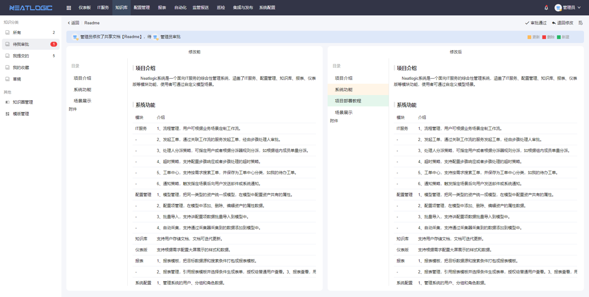

[中文](README.md) / English

    

---

## About

neatlogic-knowledge is a knowledge base module.

## The main function

### Support multiple components

In addition to ordinary text, it also contains a variety of built-in components such as tables, pictures, lists, etc.,
which can easily realize various common layouts.

### Multiple versions

- Support comparison between any versions.
  

### Knowledge Audit.

- Support for embedding knowledge audits in ITSM processes.
  

### Linkage with ITSM

- Supports direct conversion of completed work orders into knowledge base
  