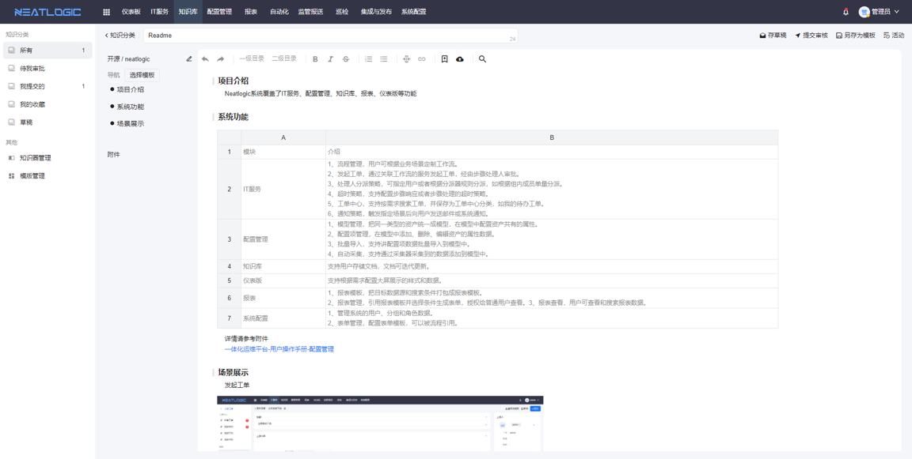
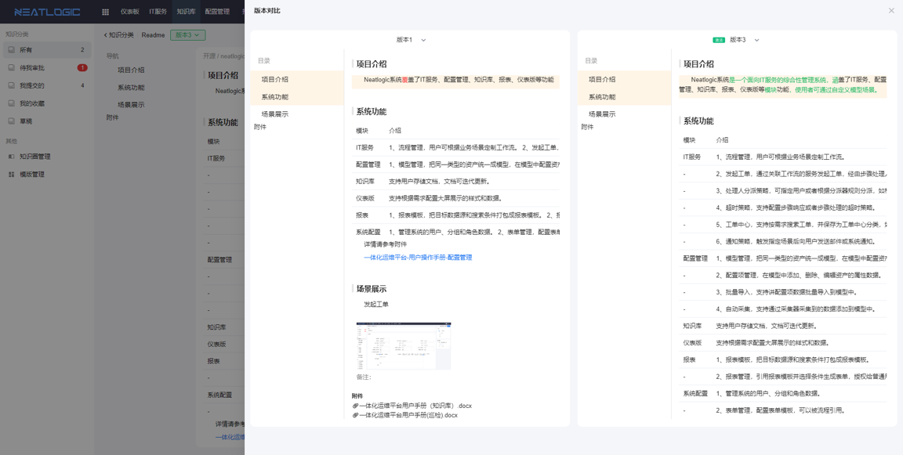
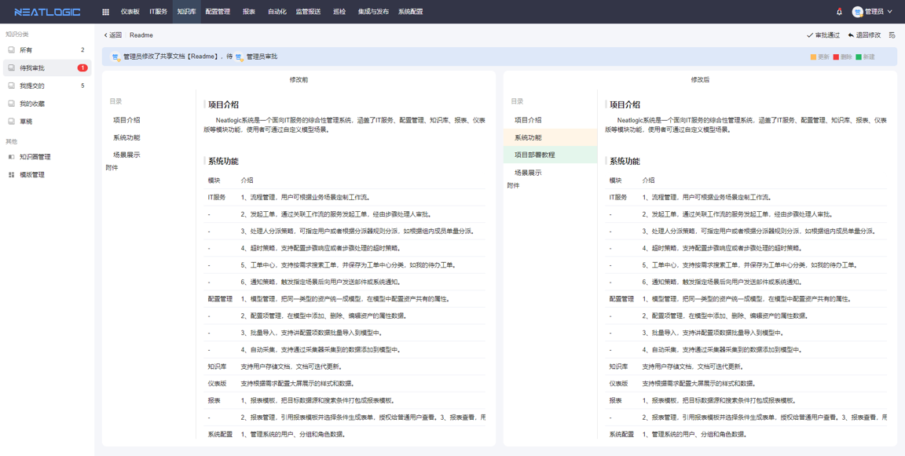
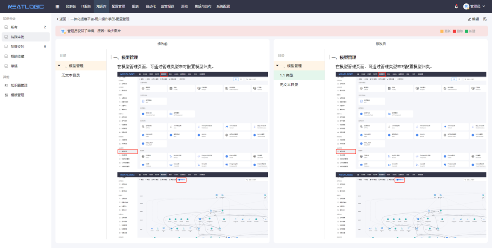
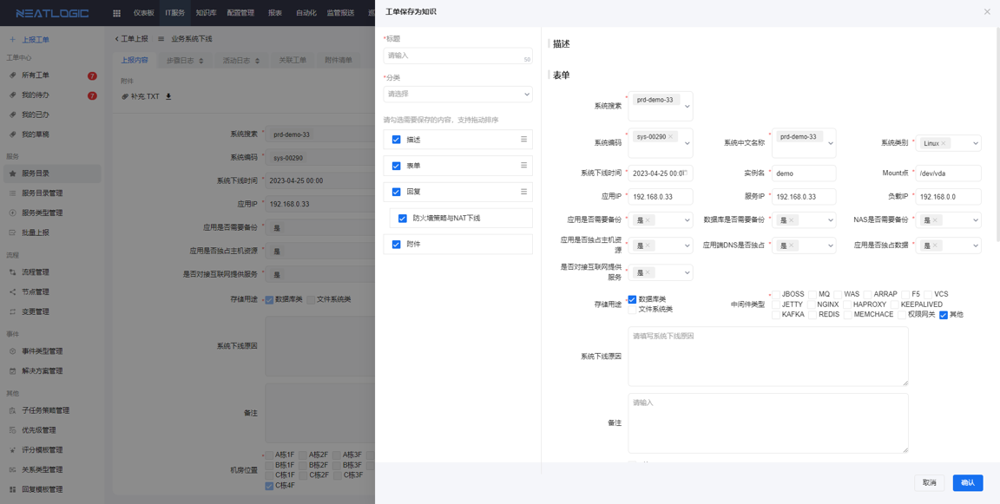

中文 / [English](README.en.md)

## 关于

neatlogic-knowledge是知识库模块。

## 主要功能

### 支持多种组件

除了普通文本，还包含表格，图片，列表等多种内置组件，轻松实现各种常见排版。

### 多版本

- 支持任意版本之间进行比对。
  

### 知识审核。

- 支持在ITSM流程中嵌入知识审核。
  

### 和ITSM联动

- 支持已完结工单直接转换成知识库
  

